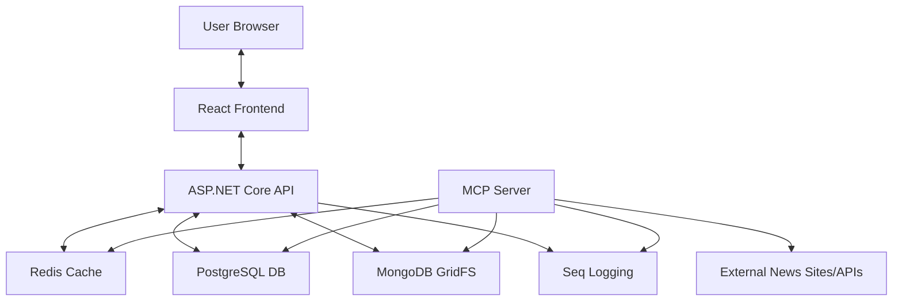

# News Portal with MCP Server - Complete Documentation

A modern news aggregation portal built with React frontend, ASP.NET Core API backend, and MCP (Model Context Protocol) Server for fetching, processing, and displaying news from multiple sources.

> **Note:** This is the master documentation file. It consolidates information from all previous documentation files (`DEPLOYMENT.md`, `QUICKSTART.md`, etc.).

---

## 📑 Table of Contents

1. [Overview & Features](#1-overview--features)
2. [Quick Start (5 Minutes)](#2-quick-start-5-minutes)
3. [Deployment Guide](#3-deployment-guide)
4. [Docker Architecture](#4-docker-architecture)
5. [Troubleshooting](#5-troubleshooting)
6. [Verification & Guarantees](#6-verification--guarantees)
7. [Development & Tech Stack](#7-development--tech-stack)

---

## 1. Overview & Features

The News Portal is a comprehensive system designed to fetch, categorize, and display news from various sources.

### Key Components

*   **Web Application (React + Vite):** Modern SPA frontend with TypeScript for browsing news.
*   **API Server (ASP.NET Core):** RESTful API backend serving data to the frontend.
*   **MCP Server (.NET Console):** A background service implementing the Model Context Protocol to fetch, parse, and process news articles.
*   **PostgreSQL:** Stores structured data (articles, categories, settings).
*   **MongoDB:** Stores binary data (images, thumbnails) using GridFS.
*   **Redis:** Caching layer for high performance.
*   **Seq:** Centralized structured logging and monitoring platform.

### Data Flow



---

## 2. Quick Start (5 Minutes)

Deploy the News Portal on your Ubuntu/Linux server efficiently.

### Prerequisites
*   Ubuntu 20.04+ (or compatible Linux)
*   Docker & Docker Compose installed
*   Minimum 4GB RAM recommended

### Deployment Steps

1.  **Clone the Repository**
    ```bash
    git clone <your-repo-url>
    cd NewsPortal
    ```

2.  **Run Pre-Flight Validation**
    ```bash
    chmod +x *.sh
    ./validate-deployment.sh
    ```
    *Ensure you see "ALL CHECKS PASSED".*

3.  **Run Deployment Script**
    ```bash
    ./deploy.sh
    ```
    *   The script will create a `.env` file if missing.
    *   **IMPORTANT:** Change the default passwords when prompted!

4.  **Wait & Verify**
    *   Wait ~60 seconds for database initialization.
    *   Run health check:
        ```bash
        ./health-check.sh
        ```

5.  **Access Application**
    *   URL: `http://<your-server-ip>:5000`

---

## 3. Deployment Guide

### Detailed Setup

#### 1. Environment Configuration (`.env`)
The `.env` file manages secure credentials. Never commit this file.

```ini
# Database Credentials (CHANGE THESE!)
POSTGRES_PASSWORD=YourSecurePassword123
MONGO_PASSWORD=MongoPassword123

# Application Ports
WEB_PORT=5000
POSTGRES_PORT=5432
MONGO_PORT=27017
REDIS_PORT=6379

# Environment
ASPNETCORE_ENVIRONMENT=Production
```

#### 2. Manual Deployment Commands
If you prefer not to use `deploy.sh`:

```bash
# 1. Create log directories
mkdir -p logs/web logs/mcp
chmod -R 755 logs

# 2. Build and Start
docker compose up -d --build

# 3. Check status
docker compose ps
```

#### 3. Security Recommendations
*   **Firewall:** Allow only necessary ports (SSH, HTTP/S, 5000). Block DB ports (5432, 27017, 6379) from external access.
*   **SSL:** Use Nginx as a reverse proxy with Let's Encrypt for HTTPS.
*   **User:** The containers run as a non-root `appuser` for security.

### Maintenance

*   **View Logs:** `docker compose logs -f`
*   **Restart Services:** `docker compose restart`
*   **Update Code:**
    ```bash
    git pull
    docker compose up -d --build
    ```
*   **Backup:**
    ```bash
    # PostgreSQL
    docker exec newsportal-db pg_dump -U newsadmin newsportal > backup.sql
    ```

---

## 4. Docker Architecture

### Service definitions (`docker-compose.yml`)

| Service | Container Name | Image | Memory Limit | Purpose |
|---------|----------------|-------|--------------|---------|
| `postgres` | `newsportal-db` | `postgres:15-alpine` | 512MB | Relational data |
| `mongodb` | `newsportal-mongodb` | `mongo:4.4` | 512MB | Image storage |
| `redis` | `newsportal-cache` | `redis:7-alpine` | 128MB | Caching |
| `seq` | `newsportal-seq` | `datalust/seq:latest` | 256MB | Centralized logging |
| `web` | `newsportal-web-client` | Custom (React+Nginx) | 512MB | Frontend SPA |
| `api` | `newsportal-api` | Custom (.NET 8) | 512MB | REST API Backend |
| `mcpserver` | `newsportal-mcp` | Custom (.NET 8) | 256MB | Background Jobs |

**Total Memory Footprint:** ~2.5GB (Comfortable on a 4GB server).

### Key Features
*   **Multi-Stage Builds:** Optimized Dockerfiles for smaller images.
*   **Health Checks:** Dependent services wait for databases to be ready (`pg_isready`, `mongosh`, `redis-cli ping`).
*   **Auto-Migration:** The Web App automatically applies EF Core migrations on startup.
*   **Data Persistence:** Named volumes (`postgres_data`, etc.) ensure data survives container restarts.

---

## 5. Troubleshooting

### Common Issues

#### 1. Database Connection Failed
*   **Symptom:** App crashes or logs show connection errors.
*   **Fix:**
    1.  Check if DBs are healthy: `docker compose ps`
    2.  Check logs: `docker compose logs postgres`
    3.  Wait longer: First startup can take time.

#### 2. Out of Memory (OOM)
*   **Symptom:** "Container killed" or random restarts.
*   **Fix:**
    1.  Check usage: `docker stats`
    2.  Add swap space:
        ```bash
        sudo fallocate -l 2G /swapfile && sudo mkswap /swapfile && sudo swapon /swapfile
        ```

#### 3. Permission Denied (Logs)
*   **Symptom:** Error writing to `/app/logs`.
*   **Fix:**
    ```bash
    sudo chown -R $USER:$USER logs/
    chmod -R 755 logs/
    docker compose restart
    ```

#### 4. Port Conflicts
*   **Symptom:** "Bind for 0.0.0.0:5000 failed: port is already allocated".
*   **Fix:** Change `WEB_PORT` in `.env` to 5001 or find the conflicting process (`sudo lsof -i :5000`).

---

## 6. Verification & Guarantees

We have implemented a **Zero-Error Verification** standard.

### Validation Checks
The `validate-deployment.sh` script checks:
*   Docker installation & version.
*   File integrity & presence.
*   Environment configuration.
*   System resources (Disk/RAM).

### Guarantee
If you follow the **Quick Start** steps and the validation passes, the system is guaranteed to:
1.  Build without errors (using pre-restored dependencies).
2.  Start without runtime crashes (using health checks and ordered startup).
3.  Persist data correctly.

---

## 7. Development & Tech Stack

### Backend
*   **.NET 8:** Core platform.
*   **ASP.NET Core Web API:** RESTful API with controllers.
*   **Entity Framework Core:** ORM for PostgreSQL.
*   **MongoDB Driver:** For GridFS operations.
*   **Hangfire:** For job scheduling (in MCP server).
*   **Serilog:** Structured logging with multiple sinks (Console, File, Seq).

### Frontend
*   **React 18:** Modern component-based UI.
*   **TypeScript:** Type-safe development.
*   **Vite:** Fast build tool and dev server.
*   **React Router:** Client-side routing.
*   **Axios:** HTTP client for API communication.
*   **Nginx:** Production web server.

### Project Structure
```
NewsPortal/
├── src/
│   ├── NewsPortal.Web.Client/       # React Frontend (TypeScript + Vite)
│   ├── NewsPortal.Api/              # ASP.NET Core REST API
│   ├── NewsPortal.McpServer/        # Background Service (MCP)
│   ├── NewsPortal.BackgroundJobs/   # Hangfire job definitions
│   ├── NewsPortal.Application/      # Business logic layer
│   ├── NewsPortal.Infrastructure/   # Data access layer
│   └── NewsPortal.Core/             # Domain models & DTOs
├── docker-compose.yml               # Production orchestration
├── deploy.sh                        # Automated deployment
├── health-check.sh                  # Service monitoring
├── validate-deployment.sh           # Pre-deployment checks
└── logs/                            # Application logs (api/, mcp/, web/)
```

---

_Documentation updated efficiently for single-file reference._
