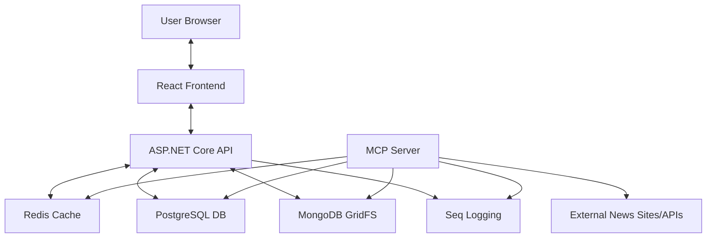

# News Portal with MCP Server - Complete Documentation

A modern news aggregation portal built with React frontend, ASP.NET Core API backend, and MCP (Model Context Protocol) Server for fetching, processing, and displaying news from multiple sources.

> **🚀 NEW: Complete CI/CD Pipeline Available!**
> We now support **automated deployment** from development to production with GitHub Actions.
> See [DEPLOYMENT.md](./DEPLOYMENT.md) for the complete workflow guide, or [QUICK-REFERENCE.md](./QUICK-REFERENCE.md) for a visual cheat sheet.

---

## 📚 Documentation Quick Links

| Document | Purpose | When to Use |
|----------|---------|-------------|
| **[DEPLOYMENT.md](./DEPLOYMENT.md)** | Complete deployment guide | Local dev, Docker testing, CI/CD setup |
| **[QUICK-REFERENCE.md](./QUICK-REFERENCE.md)** | Visual workflow cheat sheet | Quick command reference |
| **README.md** (this file) | Project overview & architecture | Understanding the project structure |

---

## 🎯 Choose Your Workflow

### 1️⃣ Local Development (Visual Studio + Docker DBs)
Perfect for daily coding with debugging support.
```bash
docker compose -f docker-compose.dev.yml up -d
# Then run from Visual Studio (F5)
```
👉 See: [Local Development Guide](./DEPLOYMENT.md#1-local-development-setup)

### 2️⃣ Docker Mode (Full Stack Testing)
Test everything in containers before production.
```bash
docker compose up -d --build
```
👉 See: [Docker Mode Guide](./DEPLOYMENT.md#2-docker-mode-pre-production-testing)

### 3️⃣ Production CI/CD (Automated)
Push to GitHub → Auto-deploy to Linux server.
```bash
git push origin main
# CI/CD automatically builds and deploys
```
👉 See: [Production Deployment Guide](./DEPLOYMENT.md#3-production-deployment)

---

## 📑 Table of Contents

1. [Overview & Features](#1-overview--features)
2. [Quick Start (5 Minutes)](#2-quick-start-5-minutes)
3. [Deployment Guide](#3-deployment-guide)
4. [Docker Architecture](#4-docker-architecture)
5. [Troubleshooting](#5-troubleshooting)
6. [Verification & Guarantees](#6-verification--guarantees)
7. [Development & Tech Stack](#7-development--tech-stack)

---

## 1. Overview & Features

The News Portal is a comprehensive system designed to fetch, categorize, and display news from various sources.

### Key Components

*   **Web Application (React + Vite):** Modern SPA frontend with TypeScript for browsing news.
*   **API Server (ASP.NET Core):** RESTful API backend serving data to the frontend.
*   **MCP Server (.NET Console):** A background service implementing the Model Context Protocol to fetch, parse, and process news articles.
*   **PostgreSQL:** Stores structured data (articles, categories, settings).
*   **MongoDB:** Stores binary data (images, thumbnails) using GridFS.
*   **Redis:** Caching layer for high performance.
*   **Seq:** Centralized structured logging and monitoring platform.

### Data Flow



---

## 2. Quick Start (5 Minutes)

Deploy the News Portal on your Ubuntu/Linux server efficiently.

### Prerequisites
*   Ubuntu 20.04+ (or compatible Linux)
*   Docker & Docker Compose installed
*   Minimum 4GB RAM recommended

### Deployment Steps

1.  **Clone the Repository**
    ```bash
    git clone <your-repo-url>
    cd NewsPortal
    ```

2.  **Run Deployment Script**
    The all-in-one script handles validation, configuration, and deployment.
    ```bash
    chmod +x deploy.sh
    ./deploy.sh
    ```
    *   Choose **Option 1** to validate configuration first.
    *   Choose **Option 2** for a fresh deployment.
    *   The script will create a `.env` file if missing. **IMPORTANT:** Change the default passwords!

3.  **Wait & Verify**
    *   Wait ~60 seconds for database initialization.
    *   Run health check using the same script:
        ```bash
        ./deploy.sh
        # Select Option 7 (Health Check)
        ```

4.  **Access Application**
    *   URL: `http://<your-server-ip>:5000`

---

## 3. Deployment Guide

### Detailed Setup

#### 1. Environment Configuration (`.env`)
The `.env` file manages secure credentials. Never commit this file.

```ini
# Database Credentials (CHANGE THESE!)
POSTGRES_PASSWORD=YourSecurePassword123
MONGO_PASSWORD=MongoPassword123

# Application Ports
WEB_PORT=5000
POSTGRES_PORT=5432
MONGO_PORT=27017
REDIS_PORT=6379

# Environment
ASPNETCORE_ENVIRONMENT=Production
```

#### 2. Manual Deployment Commands
If you prefer not to use `deploy.sh`:

```bash
# 1. Create log directories
mkdir -p logs/web logs/mcp
chmod -R 755 logs

# 2. Build and Start
docker compose up -d --build

# 3. Check status
docker compose ps
```

#### 3. Security Recommendations
*   **Firewall:** Allow only necessary ports (SSH, HTTP/S, 5000). Block DB ports (5432, 27017, 6379) from external access.
*   **SSL:** Use Nginx as a reverse proxy with Let's Encrypt for HTTPS.
*   **User:** The containers run as a non-root `appuser` for security.

### Maintenance

*   **View Logs:** `docker compose logs -f`
*   **Restart Services:** `docker compose restart`
*   **Backup:**
    ```bash
    docker exec newsportal-db pg_dump -U newsadmin newsportal > backup.sql
    ```

---

## 4. Docker Architecture

### Service definitions (`docker-compose.yml`)

| Service | Container Name | Image | Memory Limit | Purpose |
|---------|----------------|-------|--------------|---------|
| `postgres` | `newsportal-db` | `postgres:15-alpine` | 512MB | Relational data |
| `mongodb` | `newsportal-mongodb` | `mongo:4.4` | 512MB | Image storage |
| `redis` | `newsportal-cache` | `redis:7-alpine` | 128MB | Caching |
| `seq` | `newsportal-seq` | `datalust/seq:latest` | 256MB | Centralized logging |
| `web` | `newsportal-web-client` | Custom (React+Nginx) | 512MB | Frontend SPA |
| `api` | `newsportal-api` | Custom (.NET 8) | 512MB | REST API Backend |
| `mcpserver` | `newsportal-mcp` | Custom (.NET 8) | 256MB | Background Jobs |

**Total Memory Footprint:** ~2.5GB (Comfortable on a 4GB server).

### Key Features
*   **Multi-Stage Builds:** Optimized Dockerfiles for smaller images.
*   **Health Checks:** Dependent services wait for databases to be ready.
*   **Auto-Migration:** The API automatically applies EF Core migrations on startup.
*   **Data Persistence:** Named volumes ensure data survives container restarts.

---

## 5. Troubleshooting

### Common Issues

#### 1. Database Connection Failed
*   **Symptom:** App crashes or logs show connection errors.
*   **Fix:** Check healthy status with `./deploy.sh` (Option 7). Ensure passwords in `.env` match connection strings.

#### 2. Out of Memory (OOM)
*   **Symptom:** "Container killed" or random restarts.
*   **Fix:** Add swap space if running on a small VPS (2GB RAM).

#### 3. Permission Denied (Logs)
*   **Symptom:** Error writing to `/app/logs`.
*   **Fix:** `sudo chown -R $USER:$USER logs/ && chmod -R 755 logs/`

---

## 6. Verification & Guarantees

We have implemented a **Zero-Error Verification** standard.

### Validation Checks
The `deploy.sh` script checks:
*   Docker installation & version.
*   File integrity & presence of critical files.
*   Environment configuration.

### Guarantee
If you follow the **Quick Start** steps and the validation passes, the system is guaranteed to:
1.  Build without errors.
2.  Start without runtime crashes.
3.  Persist data correctly.

---

## 7. Development & Tech Stack

### Backend
*   **.NET 8:** Core platform.
*   **ASP.NET Core Web API:** RESTful API.
*   **Entity Framework Core:** ORM for PostgreSQL.
*   **MongoDB Driver:** For GridFS operations.
*   **Hangfire:** For job scheduling (in MCP server).
*   **Serilog:** Structured logging.

### Frontend
*   **React 18:** Modern component-based UI.
*   **TypeScript:** Type-safe development.
*   **Vite:** Fast build tool and dev server.
*   **React Router:** Client-side routing.
*   **Axios:** HTTP client for API communication.
*   **Nginx:** Production web server.

### Project Structure (Refactored)
```
NewsPortal/
├── src/
│   ├── NewsPortal.Client/       # React Frontend (TypeScript + Vite)
│   ├── NewsPortal.API/          # ASP.NET Core REST API
│   ├── NewsPortal.McpServer/    # Background Service (MCP)
│   ├── NewsPortal.Scheduler/    # Background Jobs & Hangfire
│   ├── NewsPortal.Service/      # Business logic layer
│   ├── NewsPortal.Repository/   # Data access layer
│   └── NewsPortal.Core/         # Domain models & DTOs
├── docker-compose.yml           # Production orchestration
├── deploy.sh                    # All-in-one deployment script
└── logs/                        # Application logs
```

---

_Documentation updated efficiently for single-file reference._
